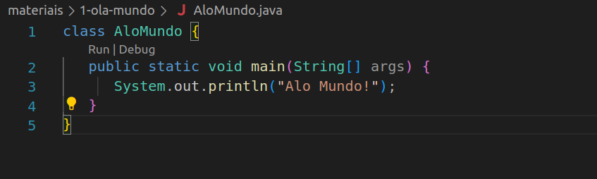
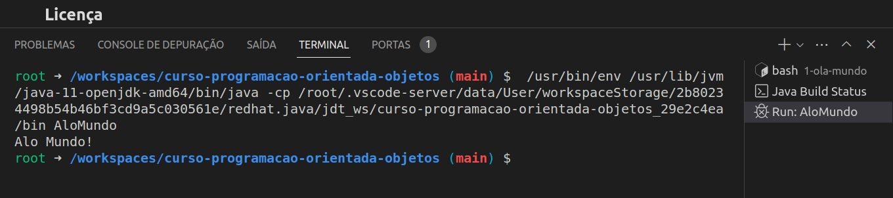
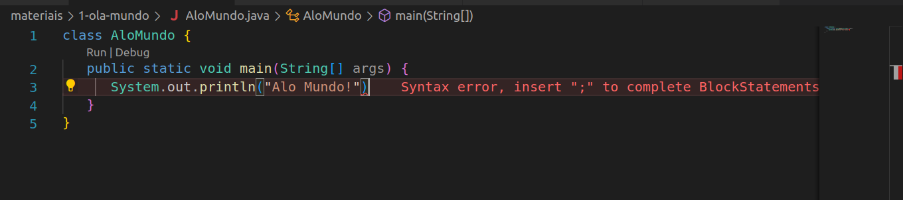

## Hello World

- Instale um SDK de Java, seja Java SE ou OpenJDK
- Considere um terminal estilo Bash, como do Ubuntu/Linux ou do WSL no Windows
- Nesse exemplo, consideramos openjdk v11

Veja o programa [AloMundo.java](AloMundo.java).

### Verificando se o Java JDK está instalado

```
$ java -version
openjdk version "11.0.22" 2024-01-16
OpenJDK Runtime Environment (build 11.0.22+7-post-Ubuntu-0ubuntu222.04.1)
OpenJDK 64-Bit Server VM (build 11.0.22+7-post-Ubuntu-0ubuntu222.04.1, mixed mode, sharing)
```

### Construção com Sistemas de Build: Maven (padrão no mercado, porém mais difícil)

O código foi inicialmente gerado pelo Maven, com `mvn archetype:generate`:
- package `HelloWorldPackage`
- artifact `alo-mundo`
- group `HelloWorldGroup`

Edite o [pom.xml](./alo-mundo/pom.xml) para incluir o [HelloWorldPackage.App](./alo-mundo/src/main/java/HelloWorldPackage/App.java) no jar:

```
<plugin>
    <artifactId>maven-jar-plugin</artifactId>
    <version>3.0.2</version>
    <configuration>
        <archive>
            <manifest>
                <mainClass>HelloWorldPackage.App</mainClass>
            </manifest>
        </archive>
    </configuration>
</plugin>
```

Execute o fluxo do Maven, dentro da pasta `alo-mundo`:

- `mvn clean`
- `mvn install`
- execute o jar:

```
$ java -jar target/alo-mundo-1.0-SNAPSHOT.jar 
Alo Mundo!
```

### Construção com Sistemas de Build: Bazel (mais fácil!)

1. Instale o Bazel (com bazelisk via NPM ou choco no Windows)
1. Crie um arquivo de [MODULE.bazel](./MODULE.bazel) vazio, e um [BUILD.bazel](./BUILD.bazel):

```
java_binary(
    name = "AloMundo",
    main_class = "AloMundo",
    srcs = glob(["*.java"]),
)
```

1. Construa o projeto com `bazel build ...`
1. Execute com bazel run:

```
$ bazel run //:AloMundo
INFO: Analyzed target //:AloMundo (0 packages loaded, 0 targets configured).
INFO: Found 1 target...
Target //:AloMundo up-to-date:
  bazel-bin/AloMundo
  bazel-bin/AloMundo.jarmateriais/1-ola-mundo/README.md
INFO: Elapsed time: 0.113s, Critical Path: 0.00s
INFO: 1 process: 1 internal.
INFO: Build completed successfully, 1 total action
INFO: Running command line: bazel-bin/AloMundo
Alo Mundo!
```

### Compilando e Executando Manualmente (somente projetos pequenos!)

- Compilando o exemplo com `javac`

```
$ javac AloMundo.java
```

- Será gerado um arquivo `AloMundo.class`
- Executando o código

```
$ java AloMundo
Alo Mundo!
```

### Utilizando a IDE VSCode (muito mais fácil!)

No VSCode com openjdk instalado no sistema e a extensão de Java, basta apertar em "Run"



O resultado deve sair no terminal:



Erros são avisados em tempo real:



Para maior organização do código, lembre-se de habilitar o Auto-Formatador em `./vscode/settings.json`, opção: `"editor.formatOnSave": true`


## Licença

CC-BY 4.0 ou MIT License
