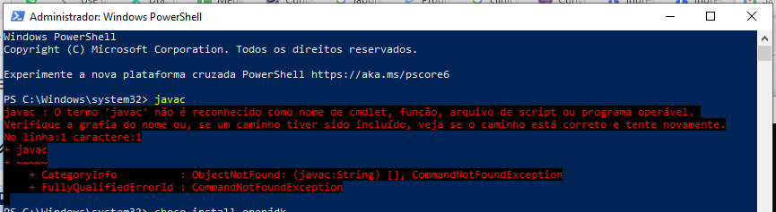
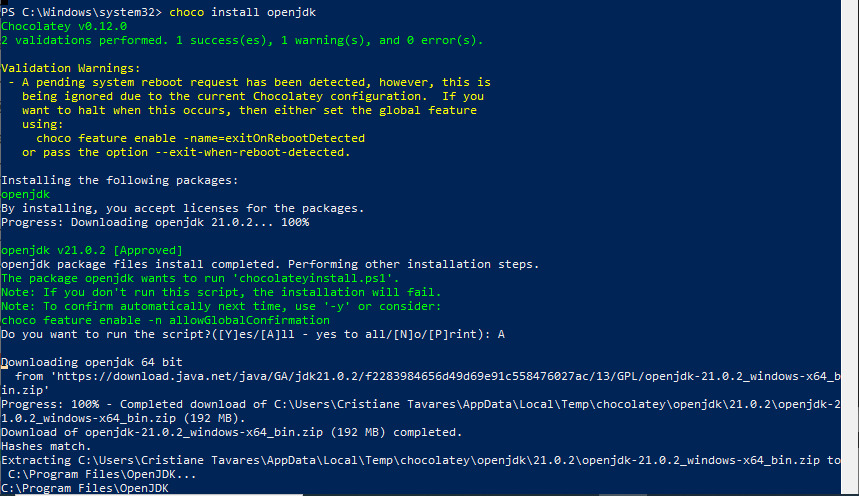
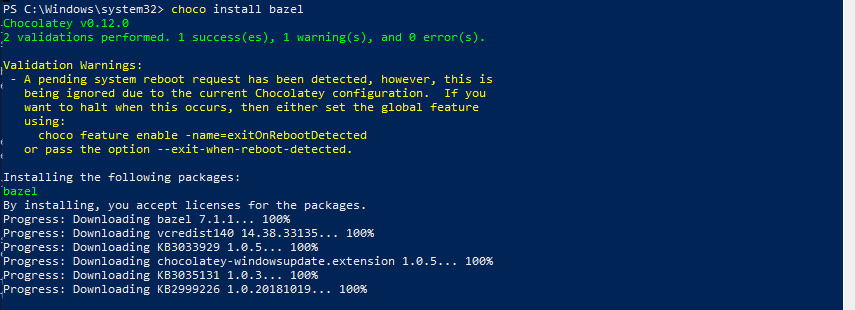
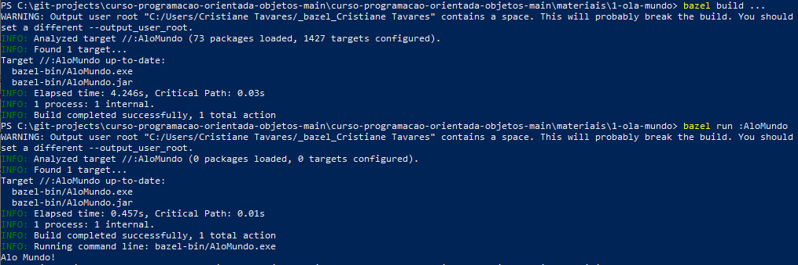

## Hello World no Windows Nativo (sem WSL)

- Instale um SDK de Java, seja Java SE ou OpenJDK
- Nesse exemplo, consideramos o uso do Chocolatey com bazel no Windows Nativo

### Instale o Chocolatey

Visite o website [chocolatey.org](https://chocolatey.org) e instale a versão mais recente no Windows.

Conheça os pacotes existentes no chocolatey em: [https://community.chocolatey.org/packages](https://community.chocolatey.org/packages)

Existem diversos pacotes interessantes, seguros e facilmente instaláveis com `choco install PACOTE`

### Verifique se você já tem o compilador `javac`

Abra um terminal no windows (de preferência Powershell) e execute o comando `javac`.
Caso não tenha compilador, aparecerá um erro, como abaixo:



Nesse caso, é preciso instalar o openjdk

### Instale o `openjdk` com o comando `choco`

Para instalar o JDK do java com o chocolatey, abra um terminal com direito de administrador e execute: `choco install openjdk`



### Instale o `bazel` com o comando `choco`

O sistema de construção Bazel é bastante popular, sendo feito pelo Google, e funciona para qualquer linguagem!
Para instalar o bazel com o chocolatey, abra um terminal com direito de administrador e execute: `choco install bazel`



### Testando o AloMundo no Windows nativo

Veja o programa [AloMundo.java](AloMundo.java).

Abra um terminal powershell (não precisa ser administrador).
Baixe esse projeto de exemplo e entre na pasta.
Finalmente, execute os comandos:

```
bazel build ...
bazel run :AloMundo
```

Deverá imprimir na tela "Alo Mundo"




## Licença

CC-BY 4.0 ou MIT License
