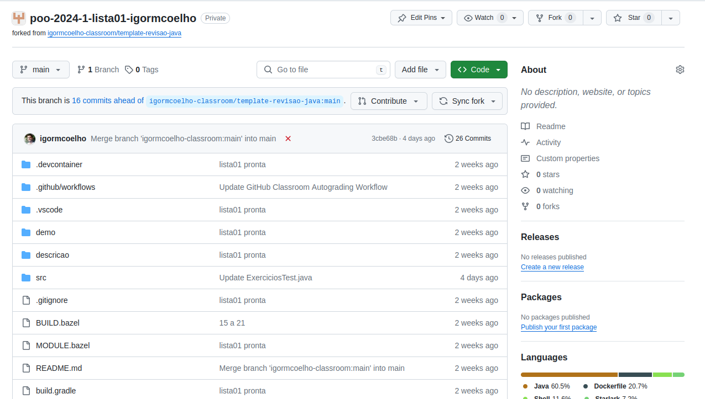

## Lista Prática no GitHub

Para fazer as listas práticas no github, faça os seguintes passos:

1. Faça um usuário no GitHub.com
2. Informe ao professor (via atividade no google classroom) qual seu nome de usuário
3. Aceite o link da atividade no GitHub Classroom
   - Será criado um repositório específico para seus testes! Veja abaixo o exemplo!

4. Entre no repositório correspondente, e faça as atividades pedidas por lá (pode ser online mesmo!)
5. Se tiver um X vermelho, ainda existe algum exercício com problema! Veja abaixo:

6. Entrando no X vermelho verá a tela do GitHub Actions com o Autograding em vermelho. Veja abaixo:

7. Clicando no Teste00, vemos que ele passou corretamente:

8. Clicando no AllTests, vemos que tem vários com problemas ainda (ex01, ex02, ..., ex14, etc):

9. Finalmente, a nota calculada está no Autograding. Observe que ele pode não computar notas parciais, e só fica 100% se estiver com todos exercícios corretos! IMPORTANTE: se QUALQUER exercício tiver erros de COMPILAÇÃO, nenhuma atividade ficará correta, pois não será gerado um executável!

10. Finalmente, recomendo execução dos testes localmente no computador na IDE VSCode ou qualquer outra de preferência!
No caso do VSCode:
  - Instale as Extensões recomendadas:
     * "vscjava.vscode-java-pack"
     * "vscjava.vscode-java-test"
     * "vscjava.vscode-gradle"
  - veja print abaixo da extensão de testes:

11. Utilizando o VSCode ou alguma IDE é bem mais fácil para ver os erros! Caso não consiga configurar, faça online mesmo, seja diretamente no GitHub ou em algum site com compilador online.