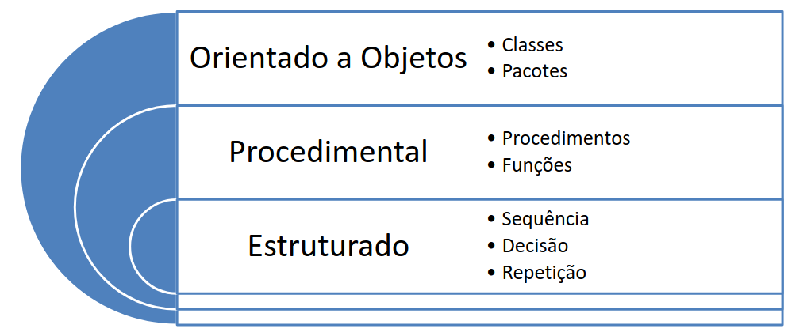
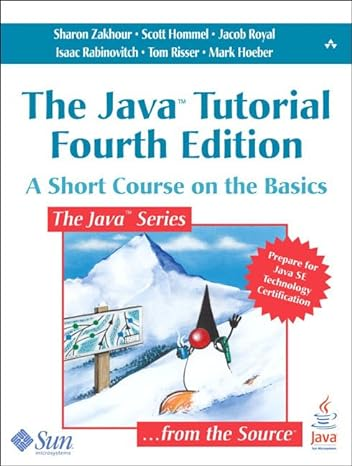
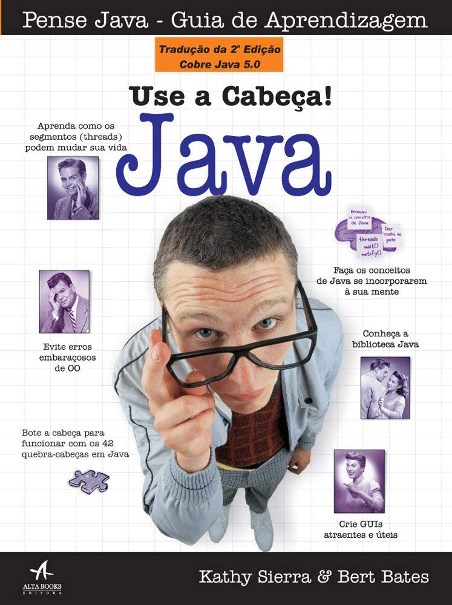

# Introdução ao Curso

------

## Boas vindas

Bem-vind@s ao curso de *Programação Orientada a Objetos*

Curso:

- Programação Orientada a Objetos - `TCC00328` (turma B1) - C.H. 64 (32 teórica + 32 prática)
- Site: https://igormcoelho.github.io/curso-programacao-orientada-objetos

Links úteis:

- http://www.ic.uff.br/index.php/pt/curriculo-e-disciplinas/disciplinas-obrigatorias
- https://app.uff.br/graduacao/quadrodehorarios
- https://app.uff.br/iduff
- Instituto de Computação (IC/UFF) - www.ic.uff.br
- Universidade Federal Fluminense (UFF) - www.uff.br

--------

## Sobre mim

::::::::::::: {.columns}

::::: {.column width=40%}

{width=50%}

e-mail (com prefixo no assunto '[POO-2024.1]'):

imcoelho at ic.uff.br (emergência)

:::::

::::: {.column width=60%}

Me chamo Igor, e é um prazer apresentar esse curso para vocês! Sou professor e pesquisador da UFF, desenvolvedor de algoritmos e sistemas (a maioria de código-aberto), bem como suas respectivas estruturas de dados (vocês saberão em breve o que é isso!). Podem me contactar pelos emails ao lado (*substituam o 'at' por '@'*), mas peço que priorizem o uso da ferramenta de Classroom do curso, que consigo responder mais rápido (com alcance aos demais alunos).
Esse curso está disponível no meu site pessoal no github: https://igormcoelho.github.io/curso-programacao-orientada-objetos

:::::

:::::::::::::

--------

## Sobre vocês

Gostaria que se apresentassem também para nos conhecermos melhor! 

Ninguém aprende 100% do que o professor ensina, e nem o professor consegue ensinar 100% de um conteúdo, então cabe aos alunos: *ler*, *estudar* e *questionar* (muito!). **Juntos** podemos trabalhar para transmitir esse conhecimento valioso para cada um de vocês.

Sempre que tiverem uma dúvida ou curiosidade, perguntem! Toda pergunta é valiosa, e o conhecimento é construído em pequenas porções.

-------

## Acordo Aluno-Professor

*Para esse curso funcionar: tenham dedicação!*

É fundamental: 

- Não atrasar entrega de trabalho, mas caso precisem de uma extensão, solicitem antes do prazo! (*atrasos podem reduzir ou até zerar notas*)
- Buscar ao máximo não perder nenhuma aula (síncrona), e caso percam, busquem o quanto antes suprir esse conteúdo
- Nunca, em hipótese alguma, copiem um trabalho pronto! Além dos efeitos práticos (como perda de nota ou demais sanções previstas nas normas), não se enganem: quem mais perde é o aluno. Conhecimento é o bem mais valioso!
- **Sempre** citem as fontes, especialmente para trechos de textos. Sempre que possivel, indique a licença de uso de imagens e códigos (os buscadores permitem buscas com licença livre, como CC-BY 4.0).

--------

## Período 2024.1 - aulas presenciais

Atividades em 2024.1

- Período: 18/03/2024 (segunda-feira) - 17/07/2024 (quarta-feira)

- Lançamento de notas: 10/07/2024 (último encontro)

Teremos aulas presenciais em horários regulares e outras diversas atividades assíncronas complementares (vídeos, textos, trabalhos, ...) para suprir toda a carga horária.

---------

## Horários Síncronos

Horários do curso: segunda e quarta 16h-28h.

(*) Algumas exceções estão previstas e algumas aulas poderão ser alteradas (caso seja necessário), mas esta é a regra geral.

--------

## Avaliação

Haverá atividades avaliativas assícronas (R), como listas de exercícios e resumos de textos/vídeos. Além disso, haverá atividades com prova (V1 e V2).

A nota N1 do curso será:

N1 = 10%R + 45%V1 + 45%V2

De acordo com as normas regulares da UFF, a nota mínima N1 para aprovação é 6.

Haverá VS para aqueles com nota superior a 4,0.

--------

## Cronograma (I)

- Período: 18/03/2024 - 17/07/2024

Tipo = Sinc./Asinc.

| Data       | Atividade                       | Tipo    |
| :---       |   :----                         | :---    |
| 18/03/2024 |  Inscrição no classroom         |  Asinc. | 
| 20/03/2024 |  Introdução ao Curso            |  Sinc.  | 

A fazer...

-------

## Cronograma (IV)

| Data       | Atividade                       | Tipo   |
| :---       |   :----                         | :---   |
| 10/07/2024 |  Lançamento Notas               |  *Asinc. |
| 17/07/2024 |  Fim Semestre                   |  *Asinc. |

-------

## Linguagem Adotada

O conteúdo do curso será focado em orientação a objetos, que 
pode ser estudada na maioria das linguagens atuais, como C/C++,
Python e Java (linguagem oficial do curso).

Naturalmente, o Java surgiu a partir do C++, que é por sua vez
uma extensão do C.
Sendo assim, todos conhecimentos prévios de C ou C++, e até de Python,
são úteis para a compreensão do curso.

Em relação a IDE para Java, qualquer uma pode ser utilizada.
O Visual Studio Code (VSCode) é bastante popular, sendo multi-linguagens.
Outra opção recomendada é a [IDE NetBeans](https://netbeans.apache.org/download/index.html) na distribuição Java SE (ou openjdk). O NetBeans é gratuito e está disponível para os principais sistemas operacionais (Linux, Mac e Windows).

(*) Agradecimentos aos professores Leonardo Murta e Vânia Neves por cederem seus materiais, como base para construção desse curso

-------

## Paradigmas de Programação: POO vs Estruturado

Dentre os paradigmas imperativos (excluindo então linguagens declarativas),
a programação orientação a objetos (POO) pode ser vista como um passo na evolução de outros paradigmas já vistos, como Estruturado/Procedimental.

-------

## Paradigma estruturado

- Só usa sequência, decisão e repetição
- Código mais fácil de ler, mas ainda difícil para sistemas
grandes devido a repetição de código
- O que fazer se for necessário repetir uma sequência de
linhas de código em diferentes locais?

-------

## Encapsulamento

- Mecanismo utilizado para lidar com o aumento de
complexidade
- Consiste em exibir “o que” pode ser feito sem
informar “como” é feito
- Permite que a granularidade de abstração do
sistema seja alterada, criando estruturas mais
abstratas

-------

## Paradigma procedimental
- Sinônimo: paradigma procedural
- Uso de subprogramação
  * Agrupamento de código permitindo a criação de ações complexas
  * Atribuição de um nome para essas ações complexas
  * Chamada a essas ações complexas de qualquer ponto do programa
- Essas ações complexas são denominadas procedimentos, sub-
rotinas ou funções

-------

## Paradigma orientado a objetos (POO ou OO)
- Classes de objetos
  *  Agrupamento de procedimentos e variáveis afins
- Pacotes de classes
  * Agrupamento de classes afins
  * Representam bibliotecas de apoio

-------

## Paradigmas de Programação: POO vs Composição

Também é importante observar que a Programação Orientada a Objetos opera de forma
complementar a paradigmas de Composição, muito explorados na atualidade, como *traits* em Rust, *CXX Concepts* em C/C++, *Protocol* em Python e Swift.

Mais à frente no curso, mostraremos como a POO pode ser utilizada em conjunto com esses outros paradigmas.

---------

## Ementa da Disciplina

1. Fundamentos da programação orientada a objetos
2. Orientação a objetos
3. Elementos da linguagem Java
4. Relacionamento entre objetos
5. Herança e polimorfismo
6. Classes abstratas e interfaces
7. Exceções
8. Threads

-------

## Bibliografia Recomendada

::::::::::::: {.columns}

::::: {.column width=40%}

{width=50%}*

{width=50%}**

:::::

::::: {.column width=60%}

(*) The Java Tutorial: A Short Course on the Basics. Edição Inglês por Sharon Biocca Zakhour (Autor), Scott Hommel (Autor), Jacob Royal (Autor), Isaac Rabinovitch (Autor), Tom Risser (Autor), Mark Hoeber (Autor) 

(**) Use a cabeça! Java: Java Capa comum – 16 novembro 2007
Edição Português por Bert Bates (Autor), Kathy Sierra (Autor)

(***) http://docs.oracle.com/javase/tutorial

:::::

::::::::::::: 

# Agradecimentos

-----

## Pessoas

Em especial, agradeço aos colegas que elaboraram bons materiais, como o prof. Leonardo Murta cujos conceitos formam o cerne desses slides.

Estendo os agradecimentos aos demais colegas que colaboraram com a elaboração do material do curso de [Pesquisa Operacional](https://github.com/igormcoelho/curso-pesquisa-operacional-i), que abriu caminho para verificação prática dessa tecnologia de slides.

-----

## Software

Esse material de curso só é possível graças aos inúmeros projetos de código-aberto que são necessários a ele, incluindo:

- pandoc
- LaTeX
- GNU/Linux
- git
- markdown-preview-enhanced (github)
- visual studio code
- atom
- revealjs
- ...

-----

## Empresas

Agradecimento especial a empresas que suportam projetos livres envolvidos nesse curso:

- github
- gitlab
- microsoft
- google
- ...

-----

## Reprodução do material

Esses slides foram escritos utilizando pandoc, segundo o tutorial ilectures:

- https://igormcoelho.github.io/ilectures-pandoc/

Exceto expressamente mencionado (como materiais cedidos por outros professores), a licença será Creative Commons.

**Licença:** CC-BY 4.0 2020

Igor Machado Coelho